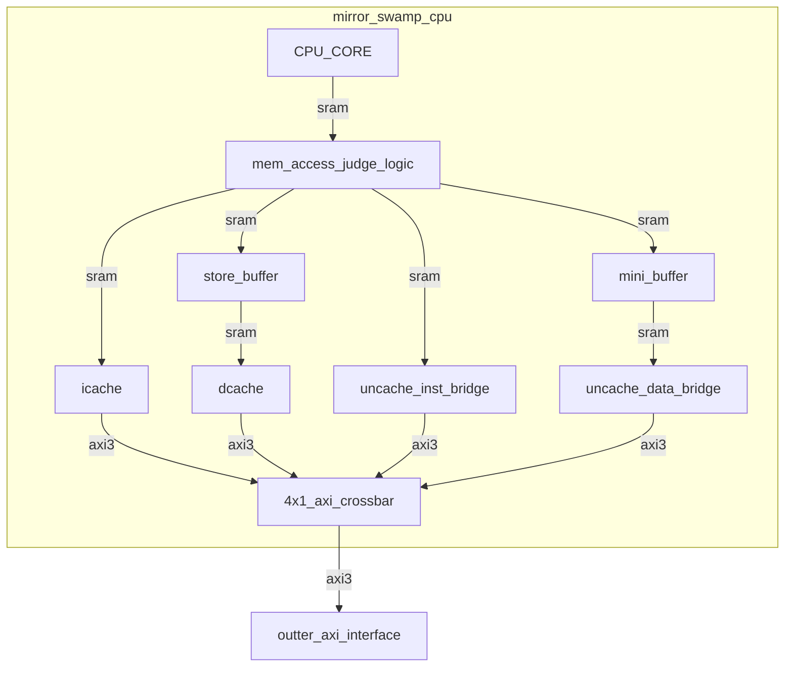

NSCSCC2019 UCAS 一队 初赛提交文档
===========================

* 中国科学院大学, 2019龙芯杯一队, 真香!
* 刘蕴哲, 陈欲晓, 王华强, 李奉治
* 文档版本 2019.8.1
* SOC版本 2019.8.1

[TOC]

# 设计简介

<!-- 简要描述所提交的设计是什么，能呈现何种功能，采用何种方式实现，实现的效果如何。如有超过大赛基本要求的特色之处，请予以说明。 -->

<!-- 我们是弟弟, 这就是个弟弟. -->

初赛提交版本为单发射静态四级流水CPU, 采用AXI3接口与外界交互. CPU使用4路组相联16KB icache 及2路组相联8KB dcache, 采用写回, 按写分配的设计. CPU访存部分针对性能测试访存模式进行了少许优化.

实现细节及实现效果请参见下文.

## 设计变更说明（可选）

<!-- 本小节仅用于决赛阶段提交设计相对于预赛阶段提交设计有变更的情况。请说明设计变更意图，并逐条简要列出设计变更内容，最终说明变更所达到的效果。 -->

# 设计方案

## 总体设计思路

<!-- 阐明总体设计思路，即从系统顶层角度出发，概要性地描述整个系统的工作机制，所需要进行哪些设计、完成哪些功能。如果设计比较复杂，那么最好进行模块划分，把每个模块功能和接口的大致情况描述一下。 -->

如上图所示, CPU的核心部分使用 sram-like 接口与外界逻辑交互. 从CPU核心向外, 访存请求首先经过仲裁逻辑. 仲裁逻辑负责cache/uncache访存的分配以及访存结果的顺序控制. 仲裁逻辑根据CPU核心流水的不同请求, 将访存请求分别交给icache, dcache 以及uncache桥访存处理. icache, dcache及访存桥在对外交互时, 会将接口信号转化为 AXI3 接口. 以上所有的对外信号最终交由 Xilinx IP AXI Crossbar处理, 其将多个来源的AXI访存请求加以汇总后以单一的AXI接口与CPU外界交互.

下对CPU的代码结构做简要的说明:

mirror_swamp_top.v::mycpu_top 是CPU的顶层模块, 使用AXI3接口与外界进行交互.

core子文件夹包含了CPU核心流水线的实现. 其中, core::mips_cpu.v::mips_cpu 是CPU核心流水的顶级模块, 流水线划分为fetch, decode, execute, writeback四级. TLB等功能也在此实现.

cache子文件夹包含了cache及其他访存相关逻辑的实现. 

axi_cache_bridge子文件夹为 Xilinx IP, 其中内容为我们所使用的 AXI 4x1 转化桥.

<!-- （二）XX模块设计（可选） -->

<!-- 对模块内部设计方案进行更进一步描述。可以包含：模块的功能意图，模块的输入输出，模块内部的数据通路和控制逻辑，以及可能的软硬件交互机制。 -->

# 设计结果

<!-- 请不要大篇幅地直接粘贴代码。 -->

## 设计交付物说明

<!-- 说明所提交设计的目录层次，各目录下对应的内容是什么。提供所提交设计进行仿真、综合、上板演示的必要操作提示步骤。 -->

## 设计演示结果

<!-- 以文字、图、表等形式展示设计的演示结果。 -->

AXI/SRAM 接口功能测试通过. 记忆游戏正常运行.

性能测试上板结果如下:

操作系统适配部分以及扩展设计仍在开发中, 将于之后的赛程中展示.

# 参考设计说明

<!-- 如果在提交设计中使用了第三方IP或者借鉴了他人的部分源代码，请在此处逐一列举，并说明出处。所谓“借鉴”是指从模块划分、接口定义、数据通路结构、状态机、关键信号含义这些方面均与原设计存在较高的相似度。 -->

## Xilinx IP :: AXI Crossbar (2.1)

CPU核心的设计中使用了赛灵思的 AXI Crossbar IP 来处理CPU的对外总线请求. 此CPU中使用的 4x1 Crossbar 会处理来自 uncache inst/data bridge, icache, dcache 的axi总线信号, 进行仲裁后发送到外部总线. 在CPU中, 此模块的定义名称为 axi_cache_bridge, 实例名称为 u_axi_cache_bridge.

Crossbar 的具体参数如下:

* number of slave interfaces 4 
* number of master interfaces 1 
* ID width 4
* Protocol AXI3
* addr/data width 32 
* base addr 0x0

# 参考文献

Xilinx IP :: AXI Crossbar (2.1)

https://www.xilinx.com/support/documentation/ip_documentation/axi_interconnect/v2_1/pg059-axi-interconnect.pdf